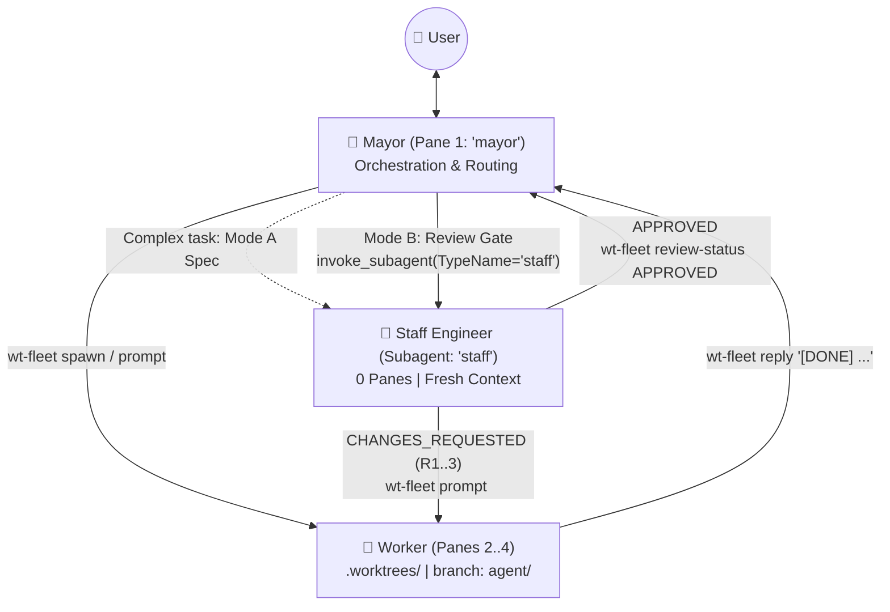

# Worktree Fleet (`wt-fleet`) Skill

`wt-fleet` (`~/bin/wt-fleet`) pairs **Git worktrees** (`.worktrees/<name>` on
branch `agent/<name>`) with **tmux panes** (strictly capped at **4 panes per
window**: 1 `mayor` orchestrator pane + up to 3 `worker` panes), **native
cross-pane messaging**, and a **headless Staff Engineer subagent (`staff`)** for
architectural specs and code review gates.



---

## 1. Orchestrator (`mayor`) Workflow

### Core Rules
1. **Dispatch, Don't Clutter Context**: Delegate coding tasks to worker panes via
   `wt-fleet` and delegate code reviews / architectural deep-dives to the
   `staff` subagent (`invoke_subagent(TypeName="staff")`).
2. **Pre-Implementation Architecture Check (On Complex Tasks)**:
   - For non-trivial or cross-cutting tasks, invoke `staff` in **Mode A
     (Architecture Spec)** before spawning the worker so the worker starts with
     clear boundaries, existing helpers to reuse, and invariants.
3. **Spawn vs. Re-Prompt (Stateful Routing)**:
   - Check `.worktrees/REGISTRY.md` or run `wt-fleet status`.
   - If the request extends an existing worker's branch/feature, **re-prompt the
     existing worker** (`wt-fleet prompt <name> "..."`).
   - If it is a distinct task, **spawn a new worker**
     (`wt-fleet spawn <name> "..."`).
   - Or use `wt-fleet dispatch <name> "..."` (prompts if alive, spawns if new).
4. **Respect the 4-Pane Window Cap**:
   - At most **4 panes** in the current window (`1 mayor + 3 workers`).
   - Merge & tear down completed workers (`wt-fleet merge <name> --teardown`)
     before spawning a 4th worker.
5. **Mandatory Staff Engineer Review Gate on `[DONE]`**:
   - When a worker replies `[DONE]`, **do not immediately ask the user to merge**.
   - Invoke `invoke_subagent(TypeName="staff", Workspace="inherit")` in **Mode B
     (Code Review Gate)** to audit `.worktrees/<name>` against the 4-dimension
     Staff Engineer rubric (Architecture & Boundaries, Correctness & Edge Cases,
     Test Integrity, Diff Hygiene — with zero pedantic theater).
   - If `staff` finds defects (`CHANGES_REQUESTED`, up to 3 rounds), `staff`
     writes `.worktrees/<name>/.wt-review.md` and directly prompts the worker
     pane via `wt-fleet prompt <name> "..."` to fix them.
   - Only when `staff` returns `APPROVED` do you present the verified summary to
     the user for merge approval.

### Command Reference

```bash
# Initialize current tmux pane as 'mayor' and set up .worktrees/ excludes
wt-fleet init

# Check all active workers, pane IDs, review status, branches, and commits ahead
wt-fleet status

# Spawn a new worker in .worktrees/<name> (branch: agent/<name>) + split tmux pane
wt-fleet spawn <name> "<detailed task prompt>" [--base <branch>]

# Smart upsert: prompt <name> if its pane is alive, otherwise spawn it
wt-fleet dispatch <name> "<task prompt>"

# Send follow-up instructions to an already-running worker pane
wt-fleet prompt <name> "<follow-up instructions>"

# Update review state (used by Staff Engineer subagent)
wt-fleet review-status <name> <REVIEWING|APPROVED|CHANGES_REQUESTED|ESCALATED> "[summary]"

# Inspect commits and git diff for a worker's branch vs its base branch
wt-fleet diff <name> [--stat]

# Merge an approved worker's branch into the main repo (& optionally close pane + remove worktree)
wt-fleet merge <name> [--squash] [--teardown]

# Close a worker's tmux pane, rebalance layout, and remove its git worktree
wt-fleet teardown <name|all> [--force]
```

---

## 2. Worker Workflow (Inside `.worktrees/<name>`)

1. **Read `.wt-task.md`** (and `.wt-review.md` if fixing review feedback).
2. **Stay Isolated**: Only modify files inside `.worktrees/<name>` on branch
   `agent/<name>`.
3. **Verify & Commit**: Run tests/builds and commit all changes cleanly to
   `agent/<name>` so `git status --porcelain` is empty.
4. **Reply to Mayor When Done or Blocked**:
   ```bash
   wt-fleet reply "[DONE] Implemented X in commit <sha>; ran <test-cmd> (all pass)."
   wt-fleet reply "[BLOCKED] Need clarification on X."
   ```
5. **Stay Open**: Remain idle at the prompt for Staff Engineer review feedback
   or follow-up tasks.
